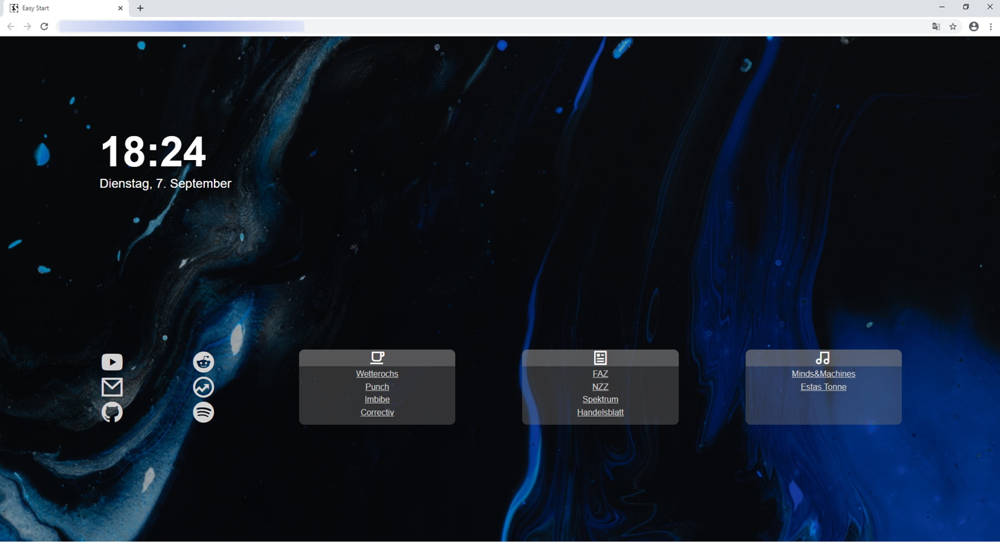

# EasyStart

Easy Start is elegant and an easy to configure startpage for any browser. <br>
There can be as many icons and linkboards be added as wished. Also the background image changes each time the site loads.
## Usage
### Links and icons
All links below can the date can be easily exchanged in the config.js file: <br>
```javascript
const ICONS = [
  {
    icon: "ri-youtube-fill",
    link: "https://www.youtube.com/"
  }, 
  ...
]
const LinkBoards = [
  {
    name: "",
    icon: "ri-cup-line",
    links: [
        {
        name: "heise",
        link: "https://www.heise.de/"
        },
        ...
    ]
  },
  ...
]
```
The icons can be found on [here](https://remixicon.com/). 
### Images
The background images themself can also be changed as long as their name is in ascending order. Only the maximum number of images needs to be set in the styles.css file. There it is also possible to only choose one background image:
```css
:root {
  --fgColor: #ffffff; /* foreground color */
  --bgColor: #212121; /* background color */
  --linkColor: lightgrey;
  --font: "Roboto"; /* custom font */
  --leftMargin: 10%;
  --LinkBoardContainersPerRow: 3;
  --numberOfBackgroundImages: 11;
  --idxForFixedBackgroundImage: -1; /* if not -1, Background Image will be fixed to certain index */ 
}
```
## Inspired By
[MinTab](https://github.com/lr-tech/MinTab) <br><br>
